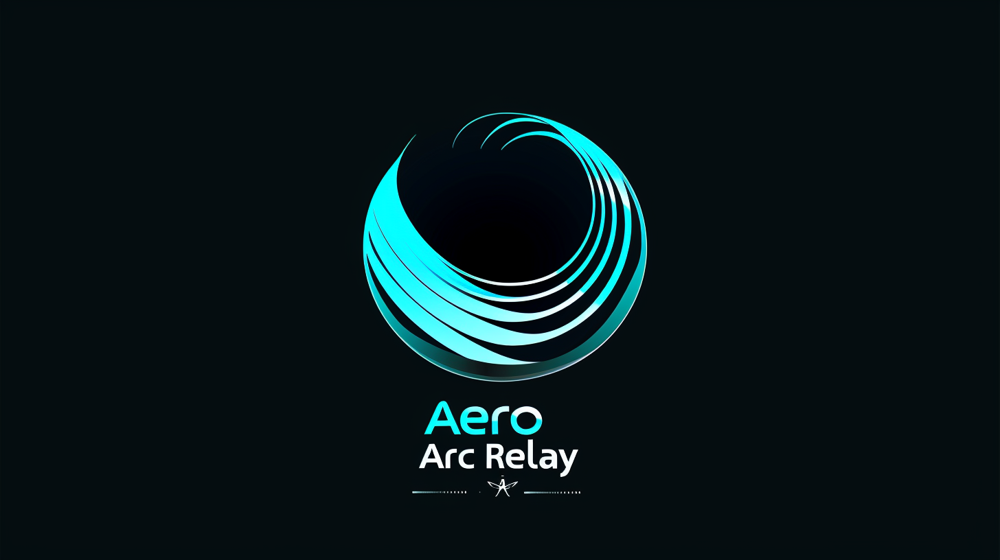

<p align="center">
  
</p>

# Aero Arc Relay

A production-ready Go-based telemetry relay that ingests MAVLink traffic and fans it out to multiple cloud storage and streaming platforms. Designed for reliability, scalability, and operational excellence.

## Highlights

- **MAVLink ingest** via gomavlib (UDP/TCP/Serial) with support for multiple dialects
- **Data sinks** (v0.1) with async queues and backpressure controls:
  - AWS S3 - Cloud object storage
  - Google Cloud Storage - GCS buckets
  - Apache Kafka - Streaming platform
  - Local file storage with rotation
- **Prometheus metrics** at `/metrics` endpoint
- **Health/ready probes** at `/healthz` and `/readyz` for orchestration
- **Graceful shutdown** with context cancellation for clean container restarts
- **Environment variable support** for secure credential management
- **Structured logging** with configurable levels and outputs

## Architecture

```
┌─────────────────┐    ┌─────────────────┐    ┌─────────────────┐
│   Drone/UAV     │    │   Ground Station│    │   Edge Agent    │
│   (MAVLink)     │    │   (MAVLink)     │    │   (MAVLink)     │
└─────────┬───────┘    └─────────┬───────┘    └─────────┬───────┘
          │                      │                      │
          └──────────────────────┼──────────────────────┘
                                 │
                    ┌────────────▼────────────┐
                    │    Aero Arc Relay       │
                    │  ┌─────────────────────┐│
                    │  │   MAVLink Handler   ││
                    │  │   (gomavlib)        ││
                    │  └─────────────────────┘│
                    │  ┌─────────────────────┐│
                    │  │  Telemetry Parser   ││
                    │  │  (Envelope Builder) ││
                    │  └─────────────────────┘│
                    │  ┌─────────────────────┐│
                    │  │   Data Sinks        ││
                    │  │   (Async Buffered)  ││
                    │  └─────────────────────┘│
                    └────────────┬────────────┘
                                 │
          ┌───────────────────────┼───────────────────────┐
          │                       │                       │
    ┌─────▼─────┐        ┌────────▼───────┐      ┌────────▼──────┐
    │   AWS S3  │        │  Apache Kafka  │      │  File Storage │
    │  GCS/GCP  │        │  (Streaming)   │      │   (Local)     │
    └───────────┘        └────────────────┘      └───────────────┘
```

## Quick Start

### Prerequisites

- Go 1.24.0 or later
- Docker and Docker Compose (for containerized deployment)

### Installation

1. Clone the repository:
```bash
git clone https://github.com/makinje/aero-arc-relay.git
cd aero-arc-relay
```

2. Install dependencies:
```bash
go mod download
```

3. Configure the application:
```bash
cp configs/config.yaml.example configs/config.yaml
# Edit configs/config.yaml with your settings
```

4. Run the application:
```bash
go run cmd/aero-arc-relay/main.go -config configs/config.yaml
```

### Docker Deployment

1. Build the Docker image:
```bash
docker build -t aeroarc/relay:latest .
```

2. Run the container:
```bash
docker run -d \
  -p 14550:14550/udp \
  -p 2112:2112 \
  -v $(pwd)/configs/config.yaml:/etc/aero-arc-relay/config.yaml \
  -e AWS_ACCESS_KEY_ID=your-key \
  -e AWS_SECRET_ACCESS_KEY=your-secret \
  aeroarc/relay:latest
```

3. View logs:
```bash
docker logs -f <container-id>
```

4. Access metrics:
```bash
curl http://localhost:2112/metrics
```

### Testing with SITL

We intentionally do not containerize SITL (Software In The Loop).

SITL is a GUI-heavy simulator that varies by distro, rendering stack, and MAVLink tooling. Aero Arc Relay expects you to bring your own SITL or real drone and point it at the relay.

**Example with ArduPilot SITL:**
```bash
sim_vehicle.py --out=udp:<relay-ip>:14550
```

This keeps the relay lightweight, portable, and cloud-ready while letting you use any simulator or real hardware that suits your development and testing needs.

## Configuration

Edit `configs/config.yaml` to configure your MAVLink endpoints and data sinks.

### MAVLink Endpoints

Configure connections to your MAVLink-enabled devices:

```yaml
mavlink:
  dialect: "common"  # common, ardupilot, px4, minimal, standard, etc.
  endpoints:
    - name: "drone-1"
      protocol: "udp"      # udp, tcp, or serial
      drone_id: "drone-alpha"  # Optional: unique identifier for the drone
      mode: "1:1"           # 1:1 or multi
      port: 14550           # Required for UDP/TCP
      # address: "0.0.0.0"  # Optional: defaults to 0.0.0.0 for server mode
    - name: "ground-station"
      protocol: "serial"
      address: "/dev/ttyUSB0"
      baud_rate: 57600
```

**Endpoint Modes:**
- `1:1`: One-to-one connection mode
- `multi`: Multi-connection mode for handling multiple clients

**Protocols:**
- `udp`: UDP server/client mode
- `tcp`: TCP server/client mode  
- `serial`: Serial port connection

### Data Sinks

> **Note:** v0.1 supports the following sinks: AWS S3, Google Cloud Storage, Apache Kafka, and Local File. Additional sinks may be available in future versions.

#### S3 Configuration

```yaml
sinks:
  s3:
    bucket: "your-telemetry-bucket"
    region: "us-west-2"
    access_key: "${AWS_ACCESS_KEY_ID}"      # Environment variable expansion
    secret_key: "${AWS_SECRET_ACCESS_KEY}"  # Leave empty to use IAM role
    prefix: "telemetry"
    flush_interval: "1m"
    queue_size: 1000
    backpressure_policy: "drop"  # drop or block
```

**Note:** If `access_key` and `secret_key` are empty, the sink will use the default AWS credential chain (IAM roles, environment variables, `~/.aws/credentials`).

#### Google Cloud Storage Configuration

```yaml
sinks:
  gcs:
    bucket: "your-gcs-telemetry-bucket"
    project_id: "your-gcp-project"
    credentials: "/path/to/service-account.json"  # Optional: uses ADC if not provided
    prefix: "telemetry"
    flush_interval: "30s"
    queue_size: 1000
    backpressure_policy: "drop"
```

#### Kafka Configuration

```yaml
sinks:
  kafka:
    brokers:
      - "localhost:9092"
      - "localhost:9093"
    topic: "telemetry-data"
    queue_size: 1000
    backpressure_policy: "drop"
```

#### File Configuration

```yaml
sinks:
  file:
    path: "/var/log/aero-arc-relay"
    prefix: "telemetry"
    format: "json"  # json, csv, binary
    rotation_interval: "24h"  # 24h, 1h, 30m, etc.
    queue_size: 1000
    backpressure_policy: "drop"
```

See `configs/config.yaml.example` for complete configuration examples.

### Environment Variables

The configuration file supports environment variable expansion using `${VAR_NAME}` syntax:

```yaml
s3:
  access_key: "${AWS_ACCESS_KEY_ID}"
  secret_key: "${AWS_SECRET_ACCESS_KEY}"
```

Set environment variables before running:
```bash
export AWS_ACCESS_KEY_ID="your-key"
export AWS_SECRET_ACCESS_KEY="your-secret"
```

## Telemetry Data Format

The relay uses a unified `TelemetryEnvelope` format for all messages:

```json
{
  "drone_id": "drone-alpha",
  "source": "drone-1",
  "timestamp_relay": "2024-01-15T10:30:00Z",
  "timestamp_device": 1705315800.123,
  "msg_id": 0,
  "msg_name": "Heartbeat",
  "system_id": 1,
  "component_id": 1,
  "sequence": 42,
  "fields": {
    "type": "MAV_TYPE_QUADROTOR",
    "autopilot": "MAV_AUTOPILOT_ARDUPILOTMEGA",
    "base_mode": 89,
    "custom_mode": 4,
    "system_status": "MAV_STATE_ACTIVE"
  },
  "raw": "base64-encoded-raw-bytes"
}
```

**Supported MAVLink Messages:**
- `Heartbeat` - System status and mode
- `GlobalPositionInt` - GPS position and velocity
- `Attitude` - Orientation and angular rates
- `VFR_HUD` - Visual flight rules HUD data
- `SystemStatus` - Battery, sensors, and system health

## Development

### Project Structure

```
aero-arc-relay/
├── cmd/aero-arc-relay/     # Main application entry point
├── internal/
│   ├── config/             # Configuration management
│   ├── relay/              # Core relay logic
│   └── sinks/              # Data sink implementations
├── pkg/
│   └── telemetry/          # Telemetry envelope structures
├── configs/                # Configuration files
├── assets/                 # Logo and assets
└── Dockerfile              # Container build definition
```

### Building

```bash
# Build binary
go build -o bin/aero-arc-relay cmd/aero-arc-relay/main.go

# Build for multiple platforms
make build-all

# Build Docker image
docker build -t aeroarc/relay:latest .
```

### Testing

```bash
# Run all tests
go test ./...

# Run with coverage
go test -cover ./...

# Run with race detection
go test -race ./...

# Run integration tests
go test ./internal/relay -tags=integration
```

### Code Quality

```bash
# Format code
go fmt ./...

# Run linter
golangci-lint run

# Run static analysis
staticcheck ./...
```

## Monitoring

### Metrics Endpoint

Prometheus metrics are exposed at `http://localhost:2112/metrics`:

**Key Metrics:**
- `aero_relay_messages_total{source,msg_name}` - Total messages processed
- `aero_relay_sink_errors_total{sink}` - Sink write errors
- `aero_sink_queue_length{sink}` - Current queue depth
- `aero_sink_enqueued_total{sink}` - Messages enqueued
- `aero_sink_dropped_total{sink}` - Messages dropped (backpressure)

### Health Endpoints

- **`/healthz`** - Liveness probe (always 200 if process is running)
- **`/readyz`** - Readiness probe (200 once sinks are initialized)

### Logging

Structured logging with configurable levels:

```yaml
logging:
  level: "info"      # debug, info, warn, error
  format: "json"     # json, text
  output: "stdout"   # stdout, file
  file: "/var/log/aero-arc-relay/app.log"  # Optional: for file output
```

## Production Deployment

### Graceful Shutdown

The relay supports graceful shutdown with context cancellation:
- Sinks have a 30-second timeout for cleanup
- HTTP server has a 10-second timeout for in-flight requests
- MAVLink connections are closed cleanly

### Container Considerations

- **Ports**: Expose UDP port 14550 for MAVLink and TCP port 2112 for metrics
- **Volumes**: Mount config file or use environment variables
- **Resources**: Minimal resource requirements; adjust based on message volume
- **Health Checks**: Use `/healthz` and `/readyz` endpoints

### Kubernetes Example

```yaml
apiVersion: apps/v1
kind: Deployment
metadata:
  name: aero-arc-relay
spec:
  replicas: 1
  template:
    spec:
      containers:
      - name: relay
        image: aeroarc/relay:latest
        ports:
        - containerPort: 14550
          protocol: UDP
        - containerPort: 2112
          protocol: TCP
        env:
        - name: AWS_ACCESS_KEY_ID
          valueFrom:
            secretKeyRef:
              name: aws-credentials
              key: access-key-id
        - name: AWS_SECRET_ACCESS_KEY
          valueFrom:
            secretKeyRef:
              name: aws-credentials
              key: secret-access-key
        livenessProbe:
          httpGet:
            path: /healthz
            port: 2112
          initialDelaySeconds: 10
        readinessProbe:
          httpGet:
            path: /readyz
            port: 2112
          initialDelaySeconds: 5
```

## Contributing

1. Fork the repository
2. Create a feature branch (`git checkout -b feature/amazing-feature`)
3. Make your changes
4. Add tests for new functionality
5. Ensure all tests pass (`go test ./...`)
6. Submit a pull request

## License

This project is licensed under the MIT License - see the LICENSE file for details.

## Support

For issues and questions:
- Create an issue on GitHub
- Check the documentation in `internal/sinks/README.md` for sink development
- Review the configuration examples in `configs/config.yaml.example`
