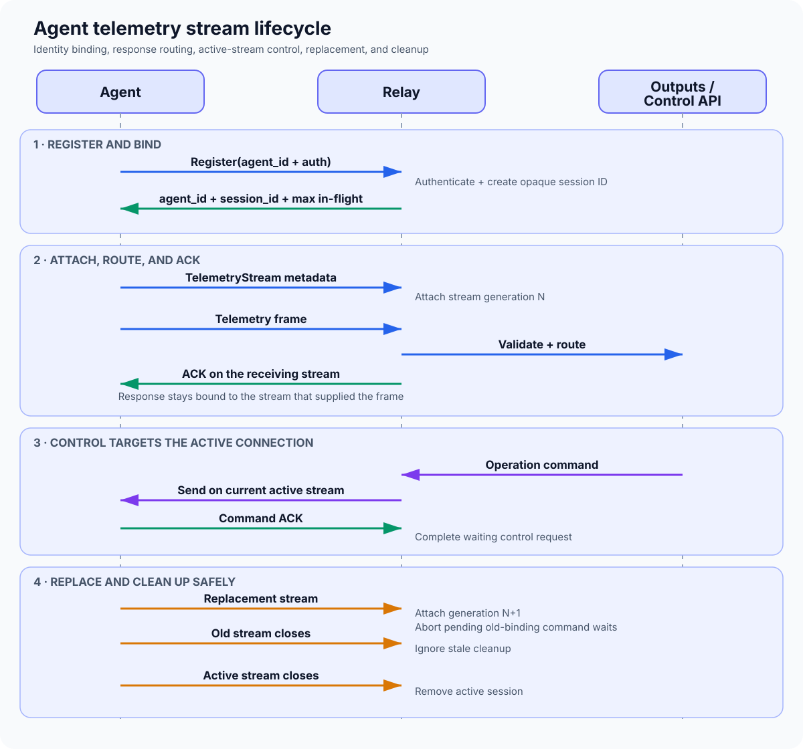
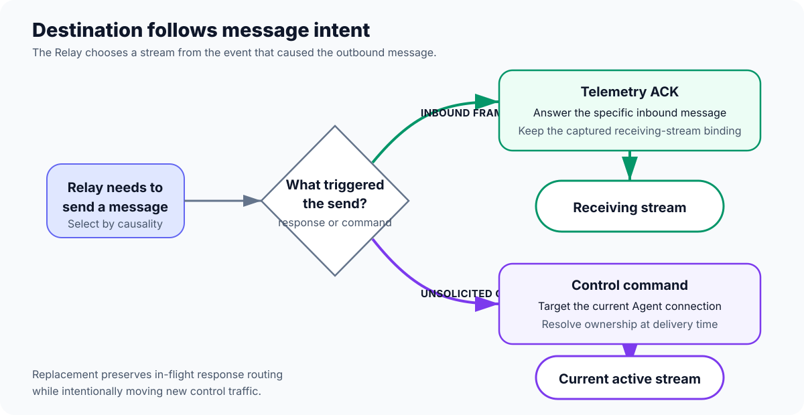
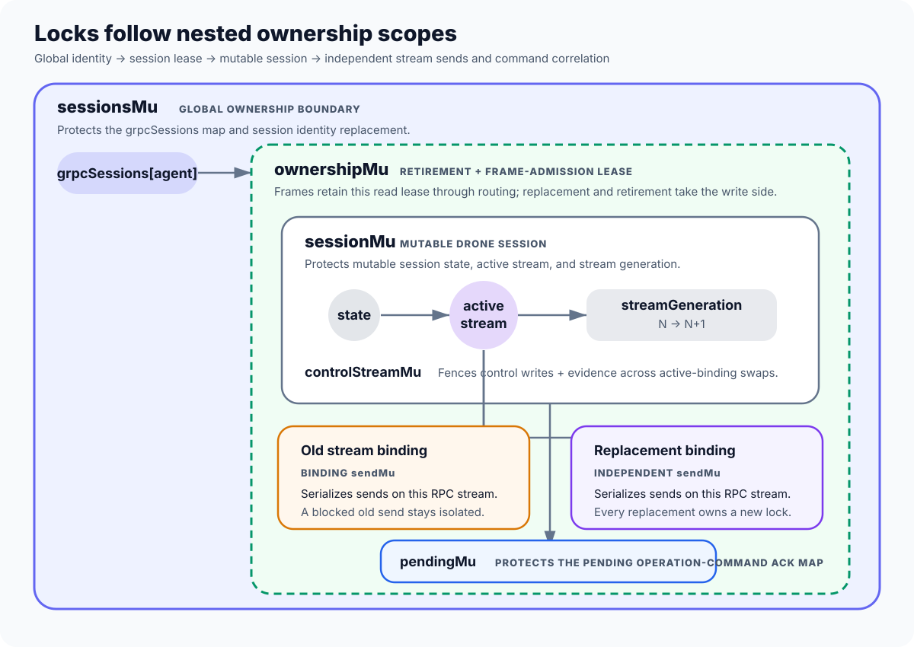

# Agent Telemetry Stream Lifecycle

This document describes how an Aero Arc agent registers with the relay, opens a
bidirectional telemetry stream, exchanges telemetry and control messages, replaces
an existing stream, and disconnects. It also defines the ownership and locking
rules that keep messages attached to the correct connection during replacement.

## Lifecycle at a Glance

## 1. Registration

An agent first calls `Register` with a non-empty agent ID and its configured
`authorization: Bearer <token>` request metadata. When Registry reporting is
enabled, the Relay authenticates the credential against that exact agent ID
before it creates or replaces any session. The relay then:

1. Generates a new opaque session ID.
2. Creates a `DroneSession` containing the agent identity, timestamps, stream
   state, operation-context state, and pending command map.
3. Stores the session in `grpcSessions`, keyed by agent ID.
4. Returns the agent ID, session ID, and advertised maximum in-flight frame
   count.

Registration does not open the telemetry stream. It creates the session that a
subsequent `TelemetryStream` call must attach to.

When operation-context control is enabled, the first session for an agent
observed by a Relay process starts with operation context unreconciled. The API
must replay its durable authoritative state with either `SetOperationContext`
for an active flight or `ClearOperationContext` with no flight ID for no active
flight. Empty-flight Clear is accepted only for this initial reconciliation;
ordinary clears remain scoped to a specific flight. Until the
Agent acknowledges that command, telemetry receives `RETRY_WITH_BACKOFF` and
remains in the Agent WAL instead of being admitted with an implicitly empty
flight and intent. This is required after Relay restart; Registry discovery and
stream admission provide the API-to-Relay replay path. Relays with context
control disabled preserve their context-free telemetry behavior.

Registering the same agent ID again replaces the map entry with a new
`DroneSession` and a new session ID. The old stream handler can still be running,
but it no longer owns the active registered session.

## 2. Attaching a Telemetry Stream

The agent opens the bidirectional `TelemetryStream` RPC and supplies its agent
ID in `aero-arc-agent-id`, the opaque registration session in
`aero-arc-session-id`, and the same bearer credential in `authorization`
request metadata. The relay rejects calls with missing metadata, invalid
credentials, a session that is not currently bound to that agent, or no prior
registration. This check completes before Registry liveness is published.

For an accepted call, `updateStream`:

1. Resolves the current `DroneSession` for the agent ID and verifies the
   metadata session ID.
2. Increments the session's stream generation.
3. Creates a stream binding containing the RPC stream, generation, and a send
   lock owned by that stream.
4. Stores the new binding as the session's active stream.
5. Returns the exact session pointer and binding to the stream handler.

The handler retains both values for its entire lifetime. They form the ownership
token used during cleanup.

Only one stream is designated as active, but a replaced handler is not forcibly
cancelled. During a handoff, the old and replacement handlers may therefore both
be alive briefly.

## 3. Receiving Telemetry

Each stream handler reads messages from its own RPC stream. For a telemetry frame,
the relay builds an ACK using the frame sequence number and validates:

- The frame agent ID matches the authenticated metadata agent ID.
- The handler's captured session still exists as the currently registered
  session for the agent.
- The frame session ID matches that captured session's ID.
- The MAVLink message name is not empty.
- The durable agent capture timestamp is present and positive.
- The API-owned operation context has been reconciled for this Relay process.

An invalid frame receives a permanent-error ACK and is not routed. A valid frame
updates the session heartbeat and is converted into a telemetry envelope using
the session's authoritative flight and intent context. Frame-provided operation
context cannot override the session state.

An otherwise valid frame received before operation-context reconciliation gets
`RETRY_WITH_BACKOFF`, not a permanent error. Once the authoritative Set/Clear is
acknowledged, the Agent can replay the same WAL records without losing them or
allowing Relay restart to erase active-flight attribution.

Validation and routing occur while holding a read lease on the captured
session's ownership. Re-registration and active-stream cleanup retire a session
under the corresponding write lock. They therefore linearize before or after
frame admission and cannot replace or remove the session halfway through an
accepted frame. The global session-map lock is not held while waiting for this
lease, so a blocked admission for one agent does not delay unrelated agents.

The envelope is then offered to configured outputs. An `OK` ACK means the
official normalized telemetry consumer accepted the envelope into its in-memory
queue after successful normalization. A deterministic normalization failure
returns `PERMANENT_ERROR`. If the queue is full, closed, or otherwise cannot
admit the record, the relay returns `RETRY_WITH_BACKOFF` so the agent retains and
retries its WAL entry. Failures from optional generic sinks are recorded but do
not change the official telemetry ACK.

Queue admission is currently an in-memory handoff, not confirmation that the
backend has durably stored the record. End-to-end durability across relay process
failure requires a relay-side durable queue or delaying `OK` until durable backend
confirmation.

The ACK is then sent on the same stream from which the frame was read. This is a
response-bound operation: the sender of a frame must receive the corresponding
ACK even if another stream becomes active between `Recv` and `Send`.

All sends use the `sendMu` on their selected stream binding. gRPC permits one
concurrent reader and one concurrent writer for a stream, but multiple concurrent
writers must be serialized. Per-stream locks prevent concurrent calls to `Send`
without allowing a blocked old stream to prevent a replacement from attaching or
sending.

## 4. Delivering Control Commands

`SetOperationContext` and `ClearOperationContext` remain disabled by default.
They are enabled only when `control_auth` supplies a client CA and an explicit
workload-identity allow list. The shared TLS listener uses
`VerifyClientCertIfGiven`: Agents continue to use their bearer credentials and
do not need client certificates, while every mutating control caller must present
a verified certificate whose common name, DNS SAN, or URI SAN is allow-listed.
An unauthenticated caller is rejected before request validation, so it cannot
probe Agent connectivity or command state.

`SendAircraftCommand` uses the same authenticated control-mutation gate. ARM
and DISARM target only the session active at admission, are not queued across a
replacement, and are not automatically retried because they are immediate
vehicle commands rather than durable operation-context mutations. Relay holds
the session ownership lease through validation and stream delivery, releases it
before waiting for the autopilot result, and aborts that pending wait if the
session is retired. A disconnected Agent can therefore be replaced even when a
control caller supplied no deadline.

Within a session, Relay retains deterministic ARM/DISARM payload fingerprints
and terminal correlation outcomes under the same bounded 24-hour/4096-entry
policy used for operation-context commands. An exact retry observes the retained
outcome without redelivery; reusing a command ID for another aircraft or command
type is rejected. A new deliberate vehicle action therefore requires a new
command ID.

`DeployMission` is the durable deployment path for a bounded canonical mission
plan. Before delivery, Relay recomputes the plan's schema-one canonical-byte
SHA-256 digest,
rejects unsupported schema/frame/command values and more than 200 items, and
requires every immutable binding field. Schema-1 plans use only
`MAV_FRAME_GLOBAL` (0) and `NAV_WAYPOINT` (16), `NAV_LAND` (21), or
`NAV_TAKEOFF` (22). They exclude autopilot HOME and export metadata; require
contiguous sequences, `autocontinue=true`, and the reserved `current=false` so
autopilot execution/readback state cannot change the digest; and carry exact
`MISSION_ITEM_INT` E7 coordinates without a legacy float-coordinate constraint.
The canonical form also requires positive-zero params 1–3, positive-zero param
4 for waypoint/takeoff, exactly `+1` param 4 for `NAV_LAND`, and finite float32
altitude that round-trips through ArduPilot's float32 multiply, truncating
signed-centimeter storage, and float32 readback conversion. The
digest bytes use the `aeroarc-mission-plan-v1\0` domain prefix, a big-endian
item count, and fixed-width big-endian item fields; protobuf wire bytes are not
part of the digest. The binding's operator and aircraft must match
`telemetry.agent_mappings` for the routed Agent. Its aircraft, flight, intent,
and intent version must also exactly match the session's
reconciled operation context; a legacy context without `aircraft_id` or an
unreconciled session cannot receive a mission. The mission route
does not replace or reshape the operational intent.

Mission command fingerprints cover the entire command, binding, and plan.
Concurrent exact retries share one delivery and terminal outcomes are retained;
reusing the command ID with another byte-level payload or retained command kind
is rejected. Exact retries attach to an already-running deployment or replay a
retained terminal outcome before contending for the serialized cross-operation
gate. They therefore remain recoverable while another operation is waiting for
Agent evidence, and one caller ending its wait cannot turn a coalesced in-flight
deployment into an unnecessary uncertain redelivery. An exact retained terminal
outcome remains replayable after the session operation context advances because
replay cannot cause another vehicle effect. For a retained retryable outcome,
the first exact retry reserves one pending delivery generation before waiting
for the gate; concurrent callers attach to that reservation, so even another
immediate retryable Agent result produces only one stream write. Only the owner
of a generation that may initiate a new stream delivery takes the gate. A
retryable outcome may be redispatched only while the session still has the exact
mission binding; otherwise Relay fails the active-context precondition without
writing to the Agent stream. Successful Agent evidence is accepted only when its
full binding matches, its onboard digest matches the requested digest, and its
uploaded item count matches the canonical plan. The Relay wait is capped at two
minutes across any required serialized command-gate admission and result
correlation, even when the caller does not provide a shorter deadline. New
commands must use a validity window no longer than five minutes.

Relay deliberately forwards an expired exact command to the current Agent. Its
in-memory command retention cannot distinguish a first expired request from
reconciliation after a Relay restart. The Agent's durable journal is therefore
the final effect fence: it may use an expired command only to read back an
already uncertain effect under the same command ID and payload, and must reject
a first expired effect before touching MAVLink. A matching readback may produce
`ALREADY_APPLIED`; a complete mismatch must be terminal and must not authorize a
replacement upload after expiry. Roll out an Agent implementing both durable
expiry fences before enabling this Relay/API path. This forwarding does not
extend the API reconciliation deadline.

Unlike a telemetry ACK, an operation-context command is not a response to a
message received on a particular stream. It targets the current admitted Agent
session. If that session changes before the ACK is returned, the Relay reports
`Aborted`; the caller can retry the same durable command ID and payload against
the replacement. The Agent WAL is the cross-session and cross-process
idempotency authority.

The delivery path:

1. Validates the agent ID and command ID.
2. Resolves the current registered session.
3. Records a deterministic payload fingerprint and pending result keyed by
   command ID.
4. Sends through the captured session, which selects and locks that session's
   current stream binding.
5. Waits for the matching command ACK or for the caller's context to end.
6. Retains the fingerprint and terminal outcome after delivery fails, times
   out, is cancelled, or receives an ACK. Exact concurrent retries share the
   pending outcome; exact retries of transient outcomes may redeliver, while a
   conflicting payload is rejected.

Waiting for the stream's send lock observes the control API context. If an
already-started gRPC `Send` remains flow-controlled past the API deadline, the
Set/Clear API request and its session ownership lease remain held until that
write returns, even after the deadline. Only then does the RPC observe context
cancellation rather than waiting for the Agent ACK. This intentional
through-write fence prevents registration from publishing a replacement while
an operation-context mutation can still land on the old Agent stream. Aircraft
commands use the same through-write session fence in their shared delivery task,
but an individual caller may detach at its deadline and must treat that command
outcome as uncertain while the started write finishes.

Incoming operation-context ACKs, aircraft-command results, and mission results
are applied only
when their command ID matches a pending request on the session captured by the
receiving stream handler and that handler still owns the active stream binding.
The pending entry is consumed before an applied ACK may update active flight and
intent state. For `APPLIED` and `ALREADY_APPLIED`, the ACK's active context must
exactly match the authoritative result derived from the API command. Relay
updates attribution from that expected result, never from unchecked Agent data.
Unsolicited and late ACKs without a current matching attempt are ignored. The
relay does not look the session up again by agent ID because the same agent may
have registered a replacement session while an old command ACK was in flight.

Relay retains outcomes per session for up to 24 hours, capped at 4096 entries,
and evicts the oldest completed outcome when the bound is reached. This bounds memory; the
Agent's durable WAL retains each command ID and payload fingerprint across
session replacement and process restart. Reusing an ID with the same payload is
one logical command. Reusing it with a different command kind or payload is a
terminal conflict and cannot mutate operation context.

This creates an intentional routing distinction:

## 5. Replacing a Stream

A registered agent may open a replacement `TelemetryStream` before its old handler
exits. The replacement increments `streamGeneration` and becomes the active
stream.

After replacement:

- New control commands target the replacement stream.
- The active-binding swap waits for any already-started control-command write;
  ordinary telemetry ACK sends remain isolated per binding and do not delay the
  replacement.
- Pending operation-context and aircraft-command waits whose write completed on
  the superseded binding finish with `Aborted` at the active-binding swap. This
  releases the serialized operation-context gate instead of waiting forever for
  evidence that is no longer authoritative. An aircraft-command caller must
  treat this result as outcome-uncertain because the old Agent may have passed
  the command to the autopilot before reconnecting.
- A delivered mission awaiting evidence completes as `OUTCOME_UNKNOWN` when its
  exact stream is replaced. The retained command is not automatically sent on
  the replacement binding, and evidence arriving on the superseded binding is
  ignored. A send that was invoked but returned a transport error has the same
  uncertainty because the Agent may have accepted it before the failure became
  visible to Relay.
- Command admission is fenced with its stream write. A command waiting behind
  the swap is admitted only after the replacement becomes active, so Relay
  cannot abort it and then deliver it on the new binding.
- Operation-context ACKs, aircraft-command results, and mission results from the
  superseded binding are ignored, even though it shares the same session ID.
- A frame already read, or subsequently read, by the old handler is ACKed on the
  old stream while the shared session remains registered.
- Sends remain serialized independently on each stream binding.
- A blocked send on the old binding does not delay attachment or sending on the
  replacement binding.
- Cleanup from the old generation cannot remove the replacement.

The generation is necessary because both streams can belong to the same
registered session and therefore have the same session ID. Session ID comparison
alone cannot distinguish an old connection from its replacement.

If the agent registers again instead of only replacing its stream, the new map
entry has a different `DroneSession` pointer and session ID. The old handler's
cleanup is rejected by the session pointer check. Frames from the old registration
also fail the active-session-identity validation and receive their error ACK on
the old stream. Relay atomically copies the last API-authoritative acknowledged
operation context into the replacement before publishing it, so reconnecting
telemetry keeps its flight and intent attribution. Delayed operation-command
ACKs received by the old handler remain bound to the old session and cannot
update the replacement session's context or pending commands.
If no prior in-process session exists, Relay does not infer an empty context:
telemetry remains retryable until the API explicitly replays Set or Clear.

## 6. Disconnect and Cleanup

The handler returns when it receives EOF, its context ends, receiving fails, or
sending an ACK fails. A deferred cleanup call then checks two conditions while
holding the session map lock:

1. The map still contains the exact `DroneSession` captured by this handler.
2. The captured stream generation is still the session's active generation.

The relay removes the session only when both conditions hold. Consequently:

- An old registration cannot delete a newly registered session.
- An old stream generation cannot delete a replacement stream in the same
  session.
- Closing the currently active stream removes its session from the active map.
- Any older handler that remains alive after active-session removal rejects new
  telemetry instead of routing it.

Once the active session is removed, the agent must register again before opening
another telemetry stream.

## Synchronization and Ownership

The stream lifecycle uses six locks with separate responsibilities:

The important ownership invariants are:

1. A handler always receives from its own stream argument.
2. A telemetry ACK is sent through that same stream argument.
3. An unsolicited command resolves the session's active stream.
4. A handler may clean up only the exact session and stream generation it owns.
5. A command rechecks its selected binding after acquiring that binding's send
   lock and retries selection if replacement occurred while it waited.
6. A frame holds its captured session's ownership lease through routing and is
   admitted only while that session is still registered and not retired.
7. A command ACK mutates only the session captured by its receiving handler.
8. A command and its pending ACK are owned by the same captured session.
9. A successful telemetry ACK requires admission by the official normalized
   telemetry consumer.
10. `controlStreamMu` linearizes through-write control sends, active-binding
    swaps, and command evidence so one command cannot cross stream generations.
11. Stream replacement captures and later revalidates its session under
    `sessionsMu`; it never waits for a per-session fence while holding the
    Relay-wide map lock, so one blocked Agent cannot stall unrelated Agents.

These rules prevent a replacement connection from receiving an unrelated ACK and
prevent stale handler cleanup from tearing down the current connection.

## Current Handoff Semantics

Stream replacement changes which stream is active, but it does not cancel the old
handler. This allows a short drain period in which the old stream can finish work
and receive ACKs for its own frames while the shared session remains registered.
It also means both handlers can temporarily submit valid telemetry for the same
session. If the active replacement closes and removes the session, any surviving
old handler returns permanent-error ACKs for later frames and does not route them.
The drain allowance applies only to telemetry; command ACKs and results from a
superseded binding never complete shared session command state.

If the protocol later requires strict single-stream ingestion, replacement should
also cancel the previous handler or cause stale generations to reject new frames.
That would be a separate policy change; the current generation mechanism provides
safe routing and cleanup without imposing that policy.

## Regression Coverage

`TestTelemetryStream_ReplacementKeepsACKAndCleanupOnReceivingStream` exercises the
replacement race by opening two streams for one registered session. It verifies
that:

- A frame read by the old stream is ACKed only on the old stream.
- Closing the old stream preserves the replacement session.
- Closing the active replacement stream removes the session.

`TestTelemetryStream_RejectsOldStreamAfterActiveReplacementCloses` verifies that
a surviving old handler cannot route telemetry after the active replacement
removes the registered session.

`TestTelemetryStream_CommandACKStaysBoundToReceivingSession` verifies that a
delayed command ACK from an old registration updates and notifies only the old
session, even when the replacement session has a pending command with the same
ID.

`TestTelemetryStream_ReplacementDoesNotWaitForBlockedOldSend` verifies that a
blocked ACK on an old stream does not prevent a replacement stream from attaching
and sending.

`TestSameSessionReplacementWaitsForControlWriteAndRejectsOldEvidence` verifies
that the active-binding swap waits for a blocked control write, aborts pending
waiters, releases the operation-context gate, and ignores both operation-context
and aircraft-command evidence from the superseded binding.

`TestRegistryBackedStreamReplacementAbortsPendingCommandsAtCommit` verifies the
same abort rule applies only when a Registry-backed replacement is successfully
published and committed, not while it is merely a pending candidate.

`TestTelemetryStream_ACKReflectsTelemetryAdmissionFailure` verifies that queue
admission failures are retryable and deterministic normalization failures are
permanent.

The relay package is also run under Go's race detector to check the synchronization
paths used by stream attachment, sending, and cleanup.
